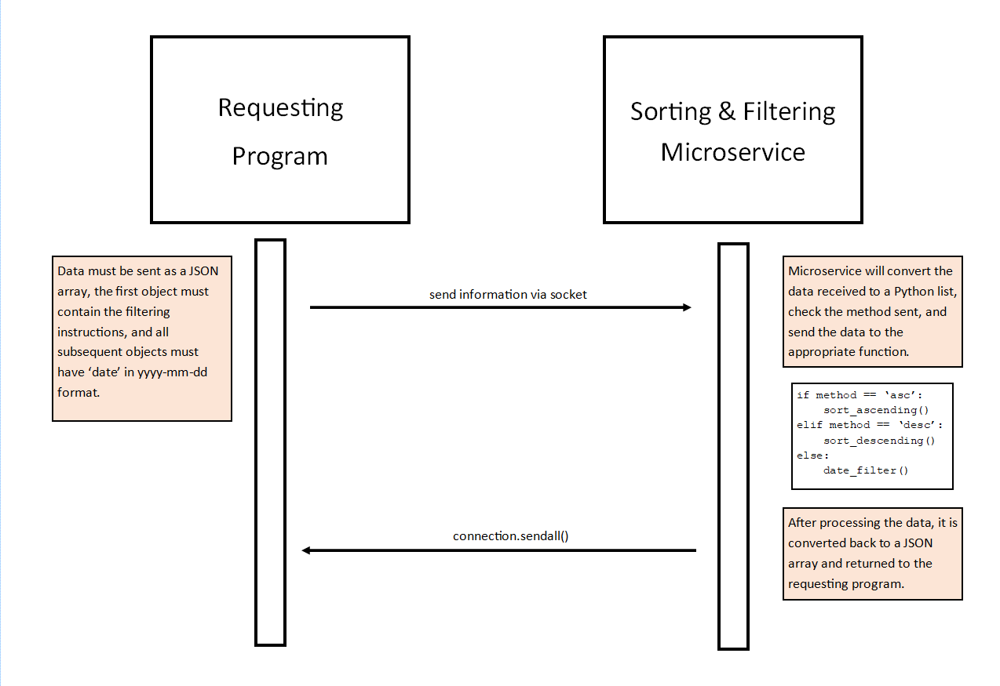

## Requesting Data

To make a request to sorter.py, a JSON array needs to be sent via
socket. Ensure that the client and server can communicate, making any
changes to hostnames and/or ports as necessary.

A JSON array is a list of JSON objects, separated by commas , and
surrounded by brackets \[ \]. The first object in the JSON array should
be as follows:

{'method': '{method_name}, 'start': '{yyyy-mm-dd}', 'end':
'{yyyy-mm-dd}'}

*'method'* refers to the task to be performed and *method_name* should
be one of the following three values:

- *'asc'* -- to sort in ascending order

- *'desc'* -- to sort in descending order

- *'filter'* -- to filter by date

If the desired method is filtering, the JSON array also needs the
*'start'* and *'end'* attributes. If the desired task is to sort in
ascending or descending order, these attributes are not necessary.
*'start'* and *'end'* need to be dates in yyyy-mm-dd format.

The remaining objects in the JSON array should be listed in the
following format:

{'id': {id_value}, 'date': yyyy-mm-dd}

*'id'* is a unique identifier for the news story and can be any value.
This field is not processed within sorter.py but is included so that
when the data is returned, the client can identify which news story is
which. Because *'id'* is not accessed by sorter.py, *id_value* can be
any value, but it is recommended to be an integer or other value of
minimal characters so that the least amount of data is transferred.

### Example Call Using Python

data_send = json.dumps(data).encode('utf-8')

client_socket.sendall(data_send)

*Note: If the data to be sent is already in JSON format, only the second
line of code is needed.*

## Receiving Data

The process of receiving data is simply the reverse of making a call.
The data is received via socket and is ready to be used in whatever way
is desired. The value of *method_name* when the data was sent will
determine the data which is received. If the value was *'asc'*, all
objects will be returned in ascending order by date. If the value was
*'desc'*, all objects will be returned in descending order by date. If
the value was *'filter'*, all objects whose *date* was between *'start'*
and *'end'* (inclusive) will be returned in the same order in which they
were sent.

### Example of Data Reception Using Python

data_recv = client_socket.recv(8192)

new_data = json.loads(data_recv.decode('utf=8'))

*Note: If the received data is desired in JSON format, only the first
line of code is needed.*

## Note Regarding the Amount of Data Transferred

Data transfer is limited by client_socket.recv(8192). To transfer more
or less data than 8192 bytes, simply change the number within the
parentheses. Smaller values have been tested, but the upper limit has
not been tested and may be situationally dependent. 8192 bytes is
sufficient to transfer around 250 objects within the JSON array if the
*'id'* field is kept as small as possible.

